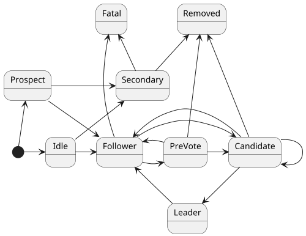

# Messaging platform
Distributed messaging platform for events, commands and queries

## Distributed setup

All nodes can serve requests. Requests may be forwarded from one node to the next.

Bounded contexts?

## Command routing

Each application subscribes to the messaging platform and provides information about the commands it can handle.
Applications dispatch commands over the AxonIQCommandBus queryDefinition bus, commands are sent to the messaging platform and 
dispatched to one application capable of handling the queryDefinition.

Commands contain a routing key, which is used by the queryDefinition dispatcher in the messaging platform to determine the handler. 
When there are no changes in the active applications, queryDefinition with the same routing key are sent to the same handler.
If there are new handlers added, the only a minimal number of routing keys per handler should be rerouted.

### Command failure

Command execution failure in application vs. infra failure. 
Must be clear to calling application what kind of error occurred. 

### Command store
Stores commands (and responses?). Techniques used similar to EventStore.
Seperate process? 
Async 

## Event routing

Messaging platform is a proxy for the event store. Applications can connect the event store to the messaging platorm.
The interface to the event dispatcher in the messaging platform is the same as to the EventStore.

ToDo: 
- blacklist action on the open stream
- bundling of tracking event processors
 
### Blacklisting

When an application has no handlers for a specific event type it can send a blacklist message to the EventDispatcher on the messaging platform.
From this moment on, it will no longer send these events to the application. This blacklist is only kept for the time the application is active, when the
application reconnects to the messaging platform the blacklist is empty.

### Event failure

## Query routing

# Clustering

## Node types

Any node can join a cluster with 4 different possible roles:

| Node type          | Events\Snapshots storage| Messaging | Voting                            | Eligible  | Participate in committing and leader step-down      |
| ------------------ |:----------:             |:---------:|:---------:                        |:---------:|:---------:                                          |
| **PRIMARY**        | yes                     | yes       | yes                               | yes       | yes, majority                                       |
| **MESSAGING ONLY** | no                      | yes       | no                                | no        | no                                                  |
| **ACTIVE BACK-UP** | yes                     | no        | yes, at least n (always vote true)| no        | yes, at least n                                     |
| **PASSIVE BACK-UP**| yes                     | no        | no                                | no        | no                                                  |

### Roles of nodes and RAFT modification

In order to introduces different roles for raft nodes, some rules 
of thumb derived from raft protocol must be changed. In particular
we have that:

- Leader Election 
    - a follower (primary) deny a vote if term < currentTerm
    - a follower (primary) grant a vote if (1) votedFor is null or candidateId and
    (2) candidate's log is at least as up-to-date as receiver's log
    - **active back-up returns always true, immediately**
    -----------------------------------------------
    - ***in order to be elected a node should receive, in the same term, 
    votes from the majority of primary nodes and at least n active 
    backup nodes (where n <= # backup nodes)***
    
- Leader Step-down (the goal is to avoid a client is connected to a 
leader that is unable to perform a commit)
    - ***if election timeout elapses without a successful round of 
    heartbeats to a majority of its cluster and at least n active 
    backup node (where n <= # backup nodes), the leader steps down***
    
- Followers
    - **if election timeout elapses without receiving AppendEntries 
    from current leader or granting vote to candidate, it converts to 
    pre-vote state if it is a primaryNode**
    
- Committing - performed by leader only
    - **if there exists an X such that (1) X > commitIndex, (2) a majority 
    of primary nodes' matchIndex[i] >= X, (3) log[X].term == currentTerm,
    (5) at least n active back-up node having matchIndex >= X, then set commitIndex = X**

The following graph represents the state diagram of raft nodes:

