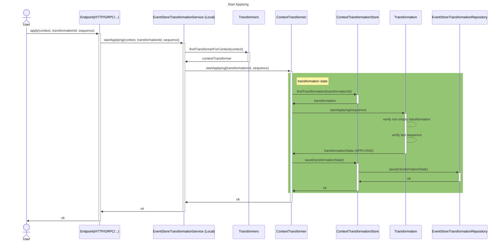
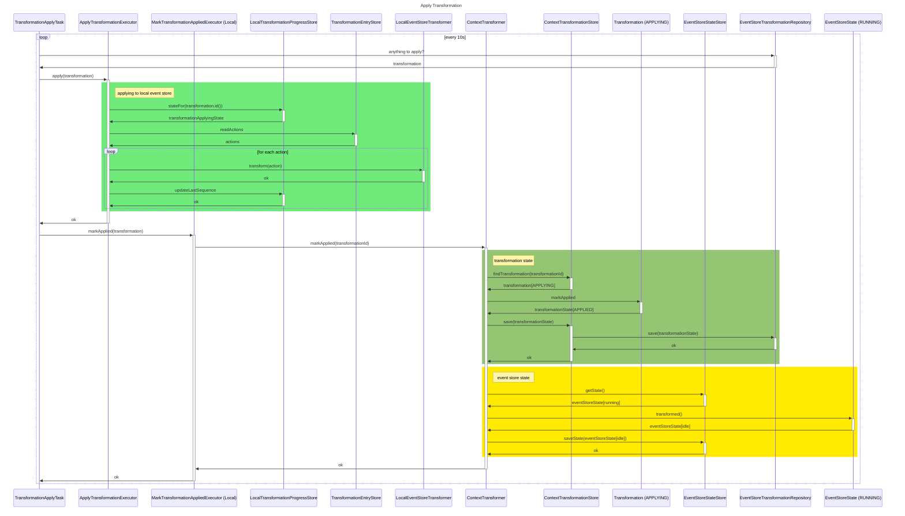

```mermaid
sequenceDiagram
    title Start Applying
    actor u as User
    participant e as Endpoint(HTTP/GRPC/...)
    participant ests as EventStoreTransformationService (Local)
    participant transformers as Transformers
    participant ct as ContextTransformer
    participant cts as ContextTransformationStore
    participant t as Transformation
    participant estr as EventStoreTransformationRepository
    u ->> +e: apply(context, transformationId, sequence)
    e ->> +ests: startApplying(context, transformationId, sequence)
    ests ->> +transformers: findTransformerForContext(context)
    transformers ->> -ests: contextTransformer
    ests ->> +ct: startApplying(transformationId, sequence)
    rect rgb(147, 197, 114)
        note right of ct: transformation state
        ct ->> +cts: findTransformation(transformationId)
        cts ->> -ct: transformation
        ct ->> +t: startApplying(sequence)
        t --> t: verify non empty transformation
        t --> t: verify last sequence 
        t ->> -ct: transformationState (APPLYING)
        ct ->> +cts: save(transformationState)
        cts ->> +estr: save(transformationState)
        estr ->> -cts: ok
        cts ->> -ct: ok
    end
    ct ->> -ests: ok
    ests ->> -e: ok
    e ->> -u: ok    
```

```mermaid
sequenceDiagram
    title Apply Transformation    
    participant tat as TransformationApplyTask
    participant ate as ApplyTransformationExecutor
    participant mtae as MarkTransformationAppliedExecutor (Local)
    participant ltps as LocalTransformationProgressStore
    participant tes as TransformationEntryStore
    participant lest as LocalEventStoreTransformer
    participant ct as ContextTransformer
    participant cts as ContextTransformationStore
    participant t as Transformation (APPLYING)
    participant esst as EventStoreStateStore
    participant estr as EventStoreTransformationRepository
    participant ess as EventStoreState (RUNNING)
    loop every 10s 
        tat ->> +estr: anything to apply?
        estr ->> -tat: transformation
        tat ->> +ate: apply(transformation)
        rect rgb(111, 234, 123)
            note right of ate: applying to local event store
            ate ->> +ltps: stateFor(transformation.id())
            ltps ->> -ate: transformationApplyingState
            ate ->> +tes: readActions
            tes ->> -ate: actions
            loop for each action
                ate ->> +lest: transform(action)
                lest ->> -ate: ok
                ate ->> +ltps: updateLastSequence
                ltps ->> -ate: ok
            end
        end
        ate ->> -tat: ok
        tat ->> +mtae: markApplied(transformation)
        mtae ->> +ct: markApplied(transformationId)
        rect rgb(147, 197, 114)
            note right of ct: transformation state
            ct ->> +cts: findTransformation(transformationId)
            cts ->> -ct: transformation[APPLYING]
            ct ->> +t: markApplied
            t ->> -ct: transformationState[APPLIED]
            ct ->> +cts: save(transformationState)
            cts ->> +estr: save(transformationState)
            estr ->> -cts: ok
            cts ->> -ct: ok
        end
        rect rgb(255, 234, 0)
            note right of ct: event store state
            ct ->> +esst: getState()
            esst ->> -ct: eventStoreState[running]
            ct ->> +ess: transformed()
            ess ->> -ct: eventStoreState[idle]
            ct ->> +esst: saveState(eventStoreState[idle])
            esst ->> -ct: ok
        end
        ct ->> -mtae: ok
        mtae ->> -tat: ok
    end
```