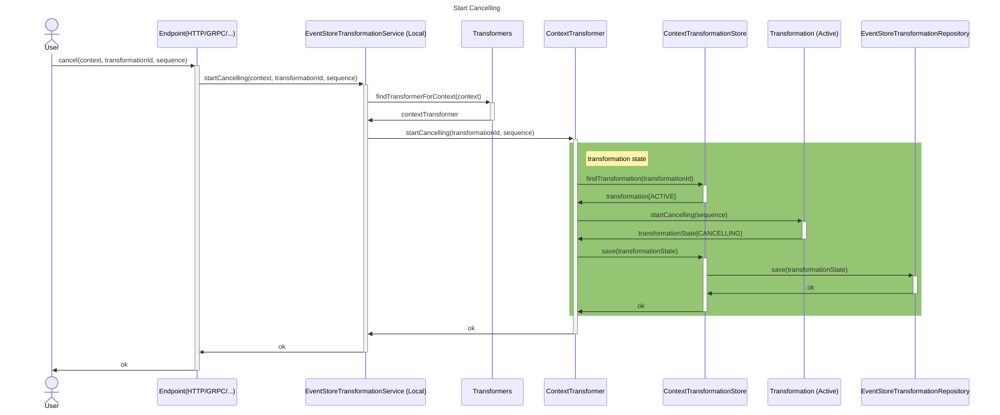
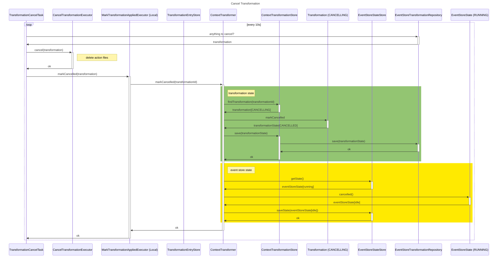

```mermaid
sequenceDiagram
    title Start Cancelling
    actor u as User
    participant e as Endpoint(HTTP/GRPC/...)
    participant ests as EventStoreTransformationService (Local)
    participant transformers as Transformers
    participant ct as ContextTransformer
    participant cts as ContextTransformationStore
    participant t as Transformation (Active)
    participant estr as EventStoreTransformationRepository
    u ->> +e: cancel(context, transformationId, sequence)
    e ->> +ests: startCancelling(context, transformationId, sequence)
    ests ->> +transformers: findTransformerForContext(context)
    transformers ->> -ests: contextTransformer
    ests ->> +ct: startCancelling(transformationId, sequence)
    rect rgb(147, 197, 114)
        note right of ct: transformation state
        ct ->> +cts: findTransformation(transformationId)
        cts ->> -ct: transformation[ACTIVE]
        ct ->> +t: startCancelling(sequence)
        t ->> -ct: transformationState[CANCELLING]
        ct ->> +cts: save(transformationState)
        cts ->> +estr: save(transformationState)
        estr ->> -cts: ok
        cts ->> -ct: ok
    end
    ct ->> -ests: ok
    ests ->> -e: ok
    e ->> -u: ok    
```

```mermaid
sequenceDiagram
    title Cancel Transformation    
    participant tct as TransformationCancelTask
    participant ate as CancelTransformationExecutor
    participant mtae as MarkTransformationAppliedExecutor (Local)
    participant tes as TransformationEntryStore
    participant ct as ContextTransformer
    participant cts as ContextTransformationStore
    participant t as Transformation (CANCELLING)
    participant esst as EventStoreStateStore
    participant estr as EventStoreTransformationRepository
    participant ess as EventStoreState (RUNNING)
    loop every 10s 
        tct ->> +estr: anything to cancel?
        estr ->> -tct: transformation
        tct ->> +ate: cancel(transformation)
        note right of ate: delete action files
        ate ->> -tct: ok
        tct ->> +mtae: markCancelled(transformation)
        mtae ->> +ct: markCancelled(transformationId)
        rect rgb(147, 197, 114)
            note right of ct: transformation state
            ct ->> +cts: findTransformation(transformationId)
            cts ->> -ct: transformation[CANCELLING]
            ct ->> +t: markCancelled
            t ->> -ct: transformationState[CANCELLED]
            ct ->> +cts: save(transformationState)
            cts ->> +estr: save(transformationState)
            estr ->> -cts: ok
            cts ->> -ct: ok
        end
        rect rgb(255, 234, 0)
            note right of ct: event store state
            ct ->> +esst: getState()
            esst ->> -ct: eventStoreState[running]
            ct ->> +ess: cancelled()
            ess ->> -ct: eventStoreState[idle]
            ct ->> +esst: saveState(eventStoreState[idle])
            esst ->> -ct: ok
        end
        ct ->> -mtae: ok
        mtae ->> -tct: ok
    end
```