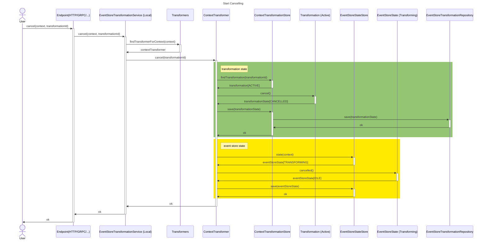

```mermaid
sequenceDiagram
    title Start Cancelling
    actor u as User
    participant e as Endpoint(HTTP/GRPC/...)
    participant ests as EventStoreTransformationService (Local)
    participant transformers as Transformers
    participant ct as ContextTransformer
    participant cts as ContextTransformationStore
    participant t as Transformation (Active)
    participant esss as EventStoreStateStore
    participant ess as EventStoreState (Transforming)
    participant estr as EventStoreTransformationRepository
    u ->> +e: cancel(context, transformationId)
    e ->> +ests: cancel(context, transformationId)
    ests ->> +transformers: findTransformerForContext(context)
    transformers ->> -ests: contextTransformer
    ests ->> +ct: cancel(transformationId)
    rect rgb(147, 197, 114)
        note right of ct: transformation state
        ct ->> +cts: findTransformation(transformationId)
        cts ->> -ct: transformation[ACTIVE]
        ct ->> +t: cancel()
        t ->> -ct: transformationState[CANCELLED]
        ct ->> +cts: save(transformationState)
        cts ->> +estr: save(transformationState)
        estr ->> -cts: ok
        cts ->> -ct: ok        
    end
    rect rgb(255, 234, 0)
        note right of ct: event store state
        ct ->> +esss: state(context)
        esss ->> -ct: eventStoreState[TRANSFORMING]
        ct ->> +ess: cancelled()
        ess ->> -ct: eventStoreState[IDLE]
        ct ->> +esss: save(eventStoreState)
        esss ->> -ct: ok  
    end
    ct ->> -ests: ok
    ests ->> -e: ok
    e ->> -u: ok    
```