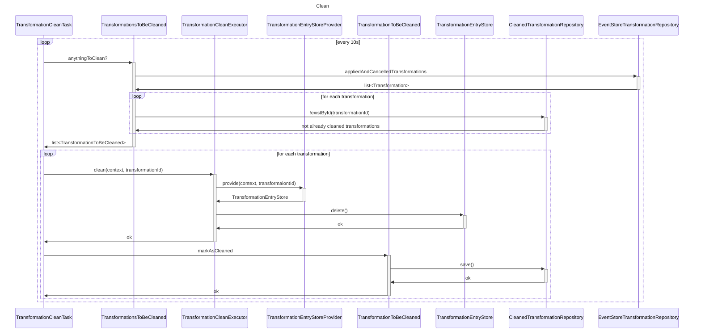

<h2>Clean</h2>

```mermaid
sequenceDiagram
    title Clean
    participant tct as TransformationCleanTask
    participant tstbc as TransformationsToBeCleaned
    participant tce as TransformationCleanExecutor
    participant tesp as TransformationEntryStoreProvider
    participant ttbc as TransformationToBeCleaned
    participant tes as TransformationEntryStore
    participant ctr as CleanedTransformationRepository
    participant estr as EventStoreTransformationRepository
    loop every 10s
        tct ->> +tstbc: anythingToClean?
        tstbc ->> +estr: appliedAndCancelledTransformations
        estr ->> -tstbc: list<Transformation>
        loop for each transformation
            tstbc ->> +ctr: !existById(transformationId)
            ctr ->> -tstbc: not already cleaned transformations
        end
        tstbc ->> -tct: list<TransformationToBeCleaned>
        loop for each transformation
            tct ->> +tce: clean(context, transformationId)
            tce ->> +tesp: provide(context, transformaiontId)
            tesp ->> -tce: TransformationEntryStore
            tce ->> +tes: delete()
            tes ->> -tce: ok            
            tce ->> -tct: ok
            tct ->> +ttbc: markAsCleaned
            ttbc ->> +ctr: save()
            ctr ->> -ttbc: ok
            ttbc ->> -tct: ok
        end
    end
```