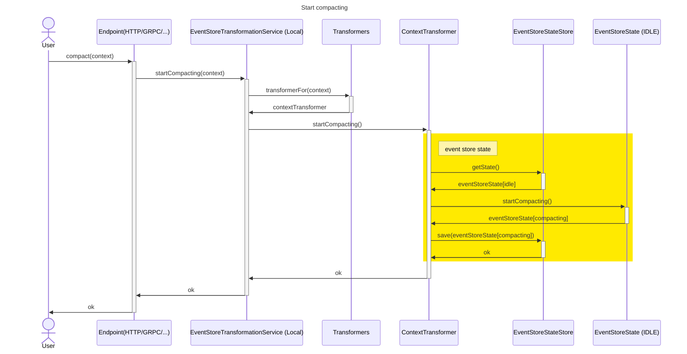
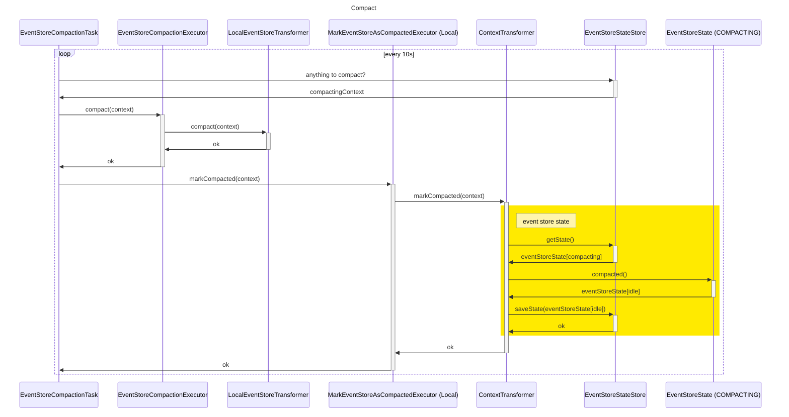

```mermaid
sequenceDiagram
    title Start compacting
    actor u as User
    participant e as Endpoint(HTTP/GRPC/...)
    participant ests as EventStoreTransformationService (Local)
    participant transformers as Transformers
    participant ct as ContextTransformer
    participant esst as EventStoreStateStore
    participant ess as EventStoreState (IDLE)
    u ->> +e: compact(context)
    e ->> +ests: startCompacting(context)
    ests ->> +transformers: transformerFor(context)
    transformers ->> -ests: contextTransformer
    ests ->> +ct: startCompacting()
    rect rgb(255, 234, 0)
      note right of ct: event store state
      ct ->> +esst: getState()
      esst ->> -ct: eventStoreState[idle]
      ct ->> +ess: startCompacting()
      ess ->> -ct: eventStoreState[compacting]
      ct ->> +esst: save(eventStoreState[compacting])
      esst ->> -ct: ok
    end
    ct ->> -ests: ok
    ests ->> -e: ok
    e ->> -u: ok
```

```mermaid
sequenceDiagram
    title Compact
    participant esct as EventStoreCompactionTask
    participant esce as EventStoreCompactionExecutor
    participant lest as LocalEventStoreTransformer
    participant mtae as MarkEventStoreAsCompactedExecutor (Local)
    participant ct as ContextTransformer
    participant esst as EventStoreStateStore
    participant ess as EventStoreState (COMPACTING)
    loop every 10s 
        esct ->> +esst: anything to compact?
        esst ->> -esct: compactingContext
        esct ->> +esce: compact(context)
        esce ->> +lest: compact(context)
        lest ->> -esce: ok
        esce ->> -esct: ok
        esct ->> +mtae: markCompacted(context)
        mtae ->> +ct: markCompacted(context)
        rect rgb(255, 234, 0)
            note right of ct: event store state
            ct ->> +esst: getState()
            esst ->> -ct: eventStoreState[compacting]
            ct ->> +ess: compacted()
            ess ->> -ct: eventStoreState[idle]
            ct ->> +esst: saveState(eventStoreState[idle])
            esst ->> -ct: ok
        end
        ct ->> -mtae: ok
        mtae ->> -esct: ok
    end
```