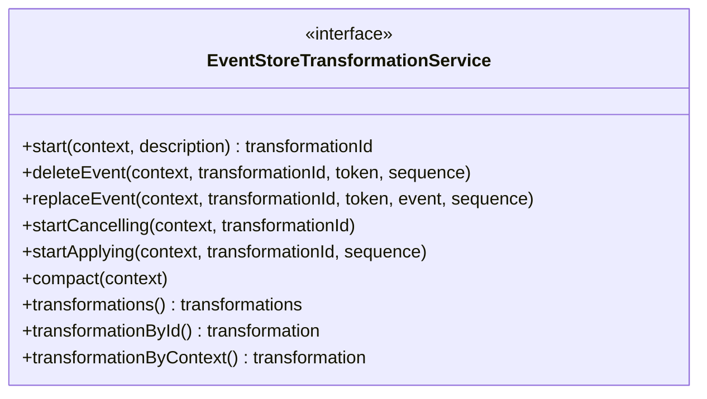
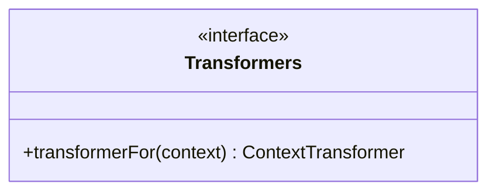
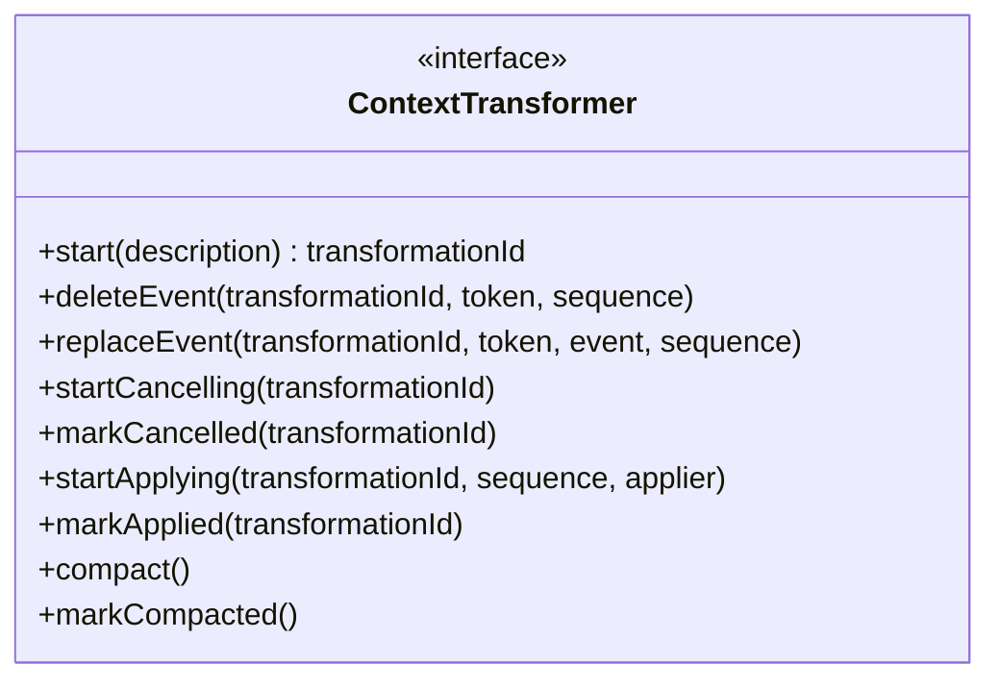
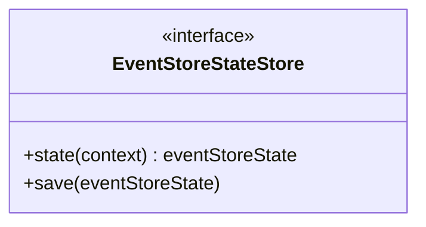
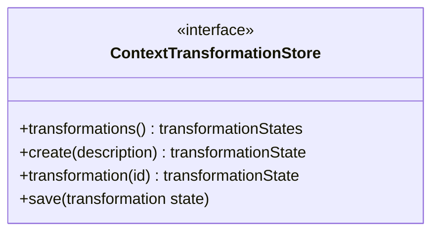
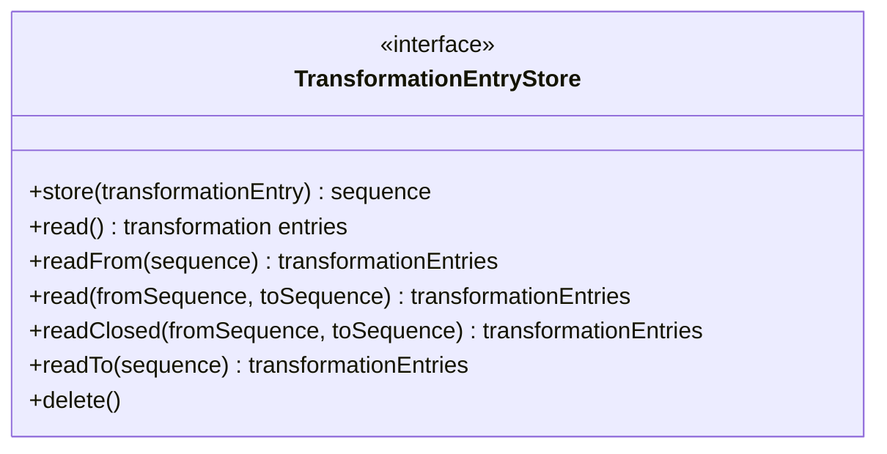

<h2>Components</h2>

```mermaid
classDiagram
    class EventStoreTransformationService {
        <<interface>>
        +start(context, description) transformationId
        +deleteEvent(context, transformationId, token, sequence)
        +replaceEvent(context, transformationId, token, event, sequence)
        +startCancelling(context, transformationId)
        +startApplying(context, transformationId, sequence)
        +compact(context)
        +transformations() transformations
        +transformationById() transformation
        +transformationByContext() transformation
    }
```

```mermaid
classDiagram
    class Transformers {
        <<interface>>
        +transformerFor(context) ContextTransformer
    }
```

```mermaid
classDiagram
    class ContextTransformer {
        <<interface>>
        +start(description) transformationId
        +deleteEvent(transformationId, token, sequence)
        +replaceEvent(transformationId, token, event, sequence)
        +startCancelling(transformationId)
        +markCancelled(transformationId)
        +startApplying(transformationId, sequence, applier)
        +markApplied(transformationId)
        +compact()
        +markCompacted()
    }
```

```mermaid
classDiagram
    class EventStoreStateStore {
        <<interface>>
        +state(context) eventStoreState
        +save(eventStoreState)
    }
```

```mermaid
classDiagram
    class ContextTransformationStore {
        <<interface>>
        +transformations() transformationStates
        +create(description) transformationState
        +transformation(id) transformationState
        +save(transformation state)
    }
```

```mermaid
classDiagram
class TransformationEntryStore {
        <<interface>>
        +store(transformationEntry) sequence
        +read() transformation entries
        +readFrom(sequence) transformationEntries
        +read(fromSequence, toSequence) transformationEntries
        +readClosed(fromSequence, toSequence) transformationEntries
        +readTo(sequence) transformationEntries
        +delete()
    }
```
