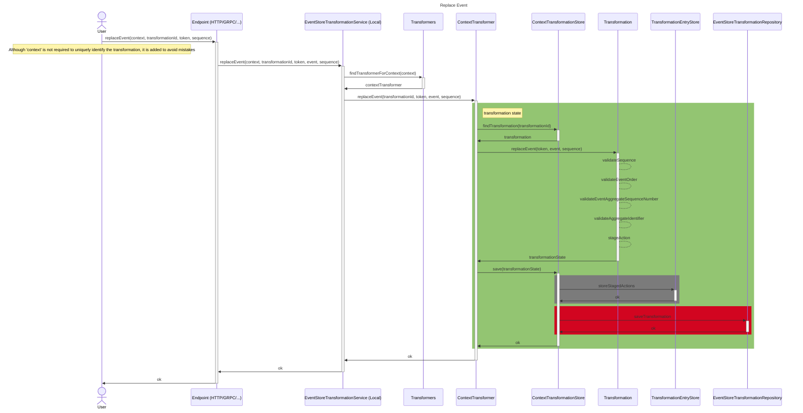

```mermaid
sequenceDiagram
    title Replace Event
    actor u as User
    participant e as Endpoint (HTTP/GRPC/...)
    participant ests as EventStoreTransformationService (Local)
    participant transformers as Transformers
    participant ct as ContextTransformer
    participant cts as ContextTransformationStore
    participant t as Transformation
    participant tes as TransformationEntryStore
    participant estr as EventStoreTransformationRepository
    u ->> +e: replaceEvent(context, transformationId, token, sequence)
    note over u: Although 'context' is not required to uniquely identify the transformation, it is added to avoid mistakes
    e ->> +ests: replaceEvent(context, transformationId, token, event, sequence)
    ests ->> +transformers: findTransformerForContext(context)
    transformers ->> -ests: contextTransformer
    ests ->> +ct: replaceEvent(transformationId, token, event, sequence)
    rect rgb(147, 197, 114)
        note right of ct: transformation state
        ct ->> +cts: findTransformation(transformationId)
        cts ->> -ct: transformation
        ct ->> +t: replaceEvent(token, event, sequence)
        t --> t: validateSequence
        t --> t: validateEventOrder
        t --> t: validateEventAggregateSequenceNumber
        t --> t: validateAggregateIdentifier
        t --> t: stageAction
        t ->> -ct: transformationState
        ct ->> +cts: save(transformationState)
        rect rgb(123, 123, 123)
            cts ->> +tes: storeStagedActions
            tes ->> -cts: ok
        end
        rect rgb(210, 5, 32)
            cts ->> +estr: saveTransformation
            estr ->> -cts: ok
        end
        cts ->> -ct: ok
    end
    ct ->> -ests: ok
    ests ->> -e: ok
    e ->> -u: ok
```