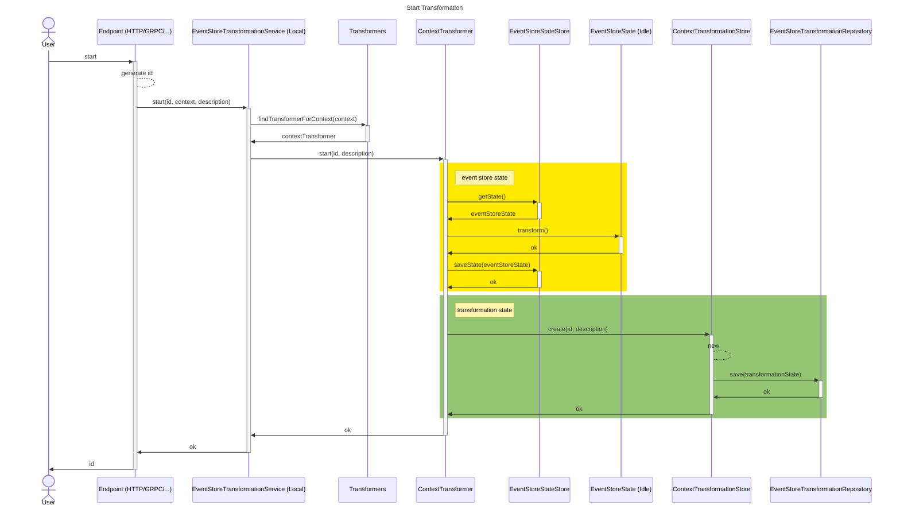

```mermaid
sequenceDiagram 
    title Start Transformation
    actor u as User
    participant e as Endpoint (HTTP/GRPC/...)
    participant ests as EventStoreTransformationService (Local)
    participant transformers as Transformers
    participant ct as ContextTransformer
    participant esst as EventStoreStateStore
    participant ess as EventStoreState (Idle)
    participant cts as ContextTransformationStore
    participant estr as EventStoreTransformationRepository
    u ->> +e: start
    e --> e: generate id
    e ->> +ests: start(id, context, description)
    ests ->> +transformers: findTransformerForContext(context)
    transformers ->> -ests: contextTransformer 
    ests ->> +ct: start(id, description)
    rect rgb(255, 234, 0)
        note right of ct: event store state
        ct ->> +esst: getState()
        esst ->> -ct: eventStoreState
        ct ->> +ess: transform()
        ess ->> -ct: ok
        ct ->> +esst: saveState(eventStoreState)
        esst ->> -ct: ok
    end
    rect rgb(147, 197, 114)
        note right of ct: transformation state
        ct ->> +cts: create(id, description)
        cts --> cts: new
        cts ->> +estr: save(transformationState)
        estr ->> -cts: ok
        cts ->> -ct: ok
    end
    ct ->> -ests: ok
    ests ->> -e: ok
    e ->> -u: id
```