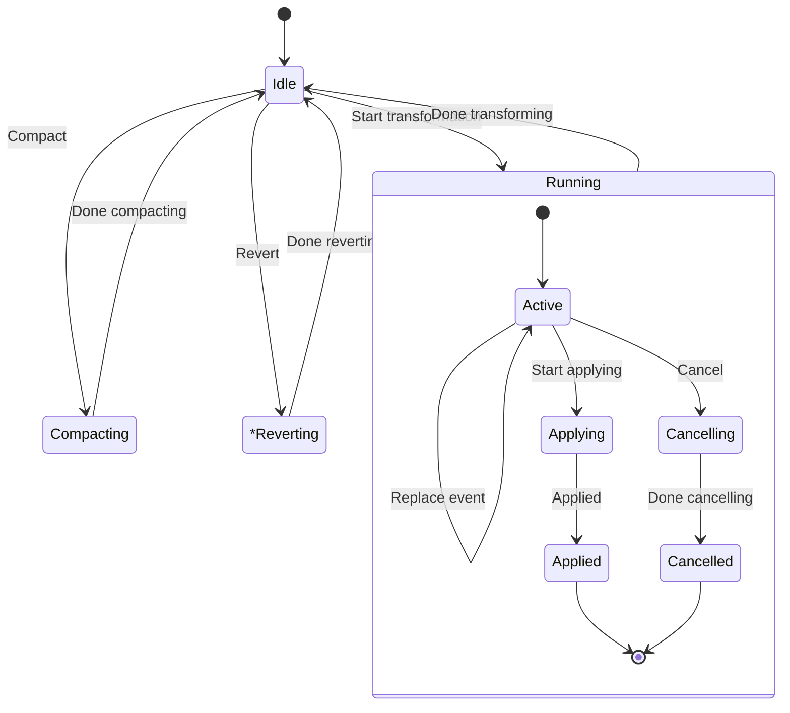

```mermaid
stateDiagram-v2
    [*] --> Idle
    Idle --> Running : Start transformation
    Running --> Idle: Done transforming
    Idle --> Compacting : Compact
    Compacting --> Idle : Done compacting
    Idle --> *Reverting : Revert
    *Reverting --> Idle : Done reverting
    
    state Running {
        [*] --> Active
        Active --> Active : Delete event
        Active --> Active : Replace event
        Active --> Applying : Start applying
        Applying --> Applied : Applied
        Active --> Cancelling : Cancel
        Cancelling --> Cancelled : Done cancelling
        Applied --> [*]
        Cancelled --> [*]
    }
```