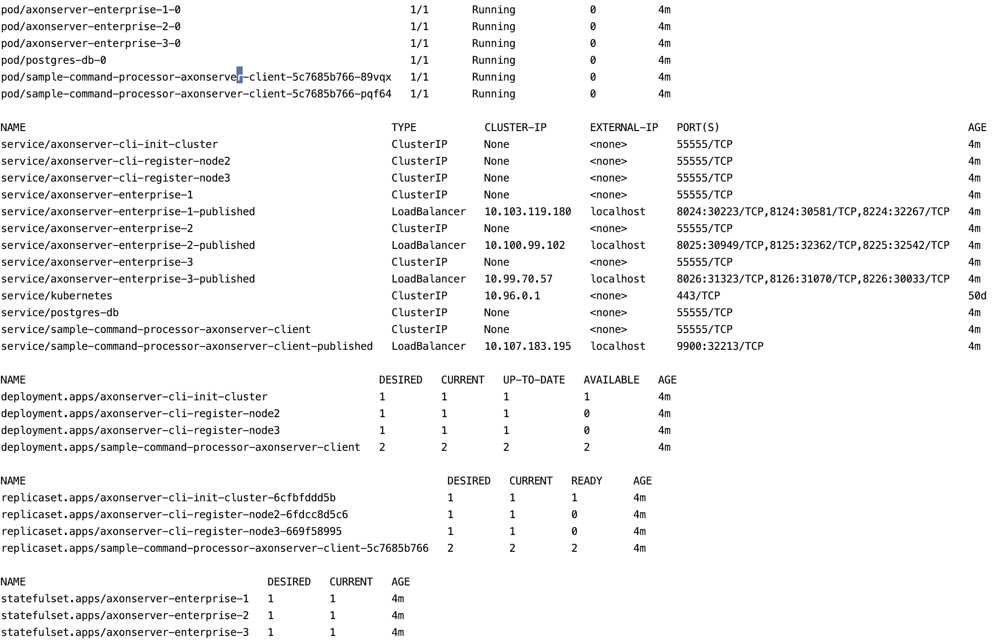

# Docker setup

This Docker setup introduces some good practices for running Axon Server in Docker.
The intention is to simplify **local (DEV, TESTING)** cluster deployment and integration testing.

Docker image creation is integrated in Maven lifecycle in non-intrusive way, and you can choose to create local Docker images of current Maven module builds.
This docker images are further composed to form Axon server/cluster, sample application and Prometheus/Grafana metrics collector.

## Prerequisite

Install [Docker Desktop](https://www.docker.com/products/docker-desktop) and run it.

## Build the Docker images

Build the application (maven modules) images with [Jib](https://github.com/GoogleContainerTools/jib) directly to a local Docker daemon. 'Jib' uses the `docker` command line tool and requires that you have docker available on your PATH.

From parent/root folder:
```bash
$ mvn clean verify jib:dockerBuild
```

> 'Jib' separates your application into multiple layers, splitting dependencies from classes. Now you don’t have to wait for Docker to rebuild your entire Java application - just deploy the layers that changed.

Jib maven plugin is configured in the [parent pom](../pom.xml) to skip Docker image build by default. Specific maven submodules ([`axonserver-enterprise`](../axonserver-enterprise/pom.xml), [`axonserver-cli`](../axonserver-cli/pom.xml), [`sample-command-processor-axonserver-client`](../sample-applications/sample-command-processor-axonserver-client/pom.xml)) are configured to build multi-layered docker image.

Your new images `axonserver-enterprise`, `axonserver-cli`, `sample-command-processor-axonserver-client` should be available in your local Docker daemon:
```bash
$ docker images
```

## Axon Enterprise Cluster (`docker-compose`)

The [docker-compose.cluster.yml](docker-compose.cluster.yml) file configures three Axon Enterprise server nodes.
It uses Docker images we created with Jib (`axonserver-enterprise`) to create three nodes `node 1`, `node 2` and `node 3`.

The [docker-compose.cluster.cli.yml](docker-compose.cluster.cli.yml) file initiate the cluster.
It uses Docker images we created with Jib (`axonserver-cli`) to initiate the cluster with `node 1` as a leader and register two more nodes (`node 2` and `node 3`).

The [docker-compose.cluster.sample-application.yml](docker-compose.cluster.sample-application.yml) files configures sample application to run against our Axon cluster.
It uses Docker images we created with Jib (`sample-command-processor-axonserver-client`) to run the application container. Additionally, application is configured to use `postgres` DB container.

The [docker-compose.cluster.monitoring.yml](docker-compose.cluster.monitoring.yml) files configures Prometheus, Grafana and Alert manager to run against our Axon cluster and collect metrics.

### Run it

You can combine different compose files to construct cluster that fits your needs best:
 - [run the test case](#test-case)
 - [only cluster](#cluster)
 - [cluster with sample application](#cluster-with-sample-application)
 - cluster with metrics
 - [cluster with sample application and metrics](#cluster-with-sample-application-and-prometheus-metrics)
 - ...

#### Test case

1 Make sure you have local Docker daemon (Docker for desktop) working.

2 Build AxonServer repo and create&install docker images to local daemon:

```bash
$ mvn clean verify jib:dockerBuild
```
3 Run three AxonServerEnterprise nodes only. Each server is configured for `default` and `_admin` context:
```bash
$ docker-compose -f docker/docker-compose.cluster.yml up -d
```
4 Initialize the cluster (wait for the servers to start first):
```bash
$ docker-compose -f docker/docker-compose.cluster.cli.yml up -d axonserver-cli-init-cluster
```
5 Register node 2:
```bash
$ docker-compose -f docker/docker-compose.cluster.cli.yml up -d axonserver-cli-register-node2
```
6 Register node 3:
```bash
$ docker-compose -f docker/docker-compose.cluster.cli.yml up -d axonserver-cli-register-node3
```
7 Run the test [application](../sample-applications/sample-command-processor-axonserver-client):
```bash
$ docker-compose -f docker/docker-compose.cluster.sample-application.yml up -d
```

>NOTE: Ideally you should be able to run all of this with one command:
>```bash
>$ docker-compose -f docker/docker-compose.cluster.yml -f docker/docker-compose.cluster.cli.yml -f docker/docker-compose.cluster.sample-application.yml up -d
>
>```
>Docker does not guarantee the 'start' ordering of this containers. 
>The problem is that our cluster configuration process is not resilient and ordering of execution commands: init, register node1, register node 2 is important.
>This is the reason why we had to manually control the ordering in 7 stpes

#### Cluster
```bash
$ docker-compose -f docker/docker-compose.cluster.yml -f docker/docker-compose.cluster.cli.yml up -d
```


#### Cluster with sample application
```bash
$ docker-compose -f docker/docker-compose.cluster.yml -f docker/docker-compose.cluster.cli.yml -f docker/docker-compose.cluster.sample-application.yml up -d
```


#### Cluster with sample application and Prometheus metrics
```bash
$ docker-compose -f docker/docker-compose.cluster.yml -f docker/docker-compose.cluster.cli.yml -f docker/docker-compose.cluster.sample-application.yml -f docker/docker-compose.cluster.monitoring.yml  up -d
```

 - Cluster is available here: [http://localhost:8024/#overview](http://localhost:8024/#overview).
 - Sample application should be available here [http://localhost:9900/cmd/echo?text=test](http://localhost:9900/cmd/echo?text=test)
 - Prometheus on [http://localhost:9090](http://localhost:9090)
 - Grafana on [http://localhost:3000](http://localhost:3000)
 - Alert Manager on [http://localhost:9093](http://localhost:9093)

Grafana username: `admin`
Grafana password: `nimda`

### Remove it

This command will stop and remove all containers (and named volumes `-v`) defined in the compose files:
```bash
$ docker-compose -f docker/docker-compose.cluster.yml -f docker/docker-compose.cluster.cli.yml down -v
```
or
```bash
$ docker-compose -f docker/docker-compose.cluster.yml -f docker/docker-compose.cluster.cli.yml -f docker/docker-compose.cluster.sample-application.yml down -v
```
or
```bash
$ docker-compose -f docker/docker-compose.cluster.yml -f docker/docker-compose.cluster.cli.yml -f docker/docker-compose.cluster.sample-application.yml -f docker/docker-compose.cluster.monitoring.yml  down -v
```
> NOTE: `-v` option will remove your persisted named volumes once the containers are removed. You can choose to exclude this option in order to backup/manage your volumes later.

## Axon Enterprise Cluster (Docker stack on Kubernetes - *experimental*)

You typically use docker-compose for local development because it can build and works only on a single docker engine. Docker stack and docker service commands require a `Docker Swarm (configured by defaut)` or `Kubernetes cluster`, and they are step towards production.

[Docker Desktop](https://www.docker.com/products/docker-desktop) comes with Kubernetes and the Compose controller built-in, and enabling it is as simple as ticking a box in the settings.

Now, we can use our Docker Compose files and native Docker API for [`stacks`](https://docs.docker.com/engine/reference/commandline/stack/) to manage applications/services on local Kubernetes cluster.

```bash
$ docker stack deploy --orchestrator=kubernetes -c docker/docker-compose.cluster.yml -c docker/docker-compose.cluster.sample-application.yml -c docker/docker-compose.cluster.cli.yml test-stack
```
Explore resources via `kubectl`
```bash
$ kubectl get all
```


You can access Kubernetes Dashboard by running the following command:

```bash
$ kubectl proxy
```
Kubectl will make Dashboard available at [http://localhost:8001/api/v1/namespaces/kube-system/services/kubernetes-dashboard/proxy](http://localhost:8001/api/v1/namespaces/kube-system/services/kubernetes-dashboard/proxy)

To remove resources:
```bash
$ docker stack rm --orchestrator=kubernetes test
```
> Persistent volumes will not be removed.
