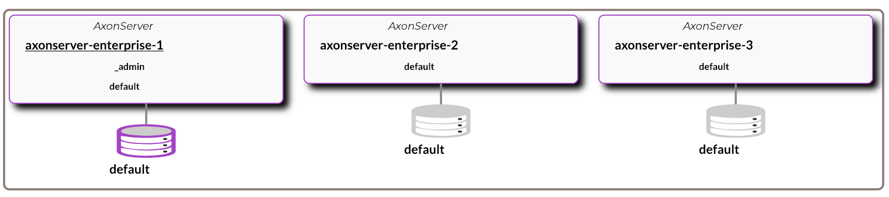
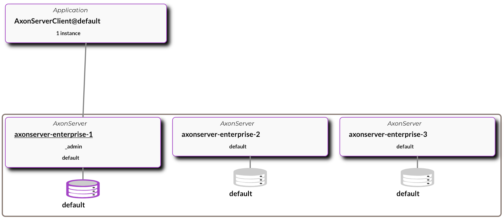

# Docker setup

This Docker setup introduces some good practices for running Axon Server in Docker.
The intention is to simplify **local (DEV, TESTING)** cluster deployment and integration testing.

Docker image creation is integrated in Maven lifecycle in non-intrusive way, and you can choose to create local Docker images of current Maven module builds.
This docker images are further composed to form Axon server/cluster, sample application and Prometheus/Grafana metrics collector.

## Prerequisite

Install [Docker Desktop](https://www.docker.com/products/docker-desktop) and run it.

## Build the Docker images

Build the application (maven modules) images with [Jib](https://github.com/GoogleContainerTools/jib) directly to a local Docker daemon. 'Jib' uses the `docker` command line tool and requires that you have docker available on your PATH.

From parent/root folder:
```bash
$ mvn clean verify jib:dockerBuild
```

> 'Jib' separates your application into multiple layers, splitting dependencies from classes. Now you don’t have to wait for Docker to rebuild your entire Java application - just deploy the layers that changed.

Jib maven plugin is configured in the [parent pom](../pom.xml) to skip Docker image build by default. Specific maven submodules ([`axonserver-enterprise`](../axonserver-enterprise/pom.xml), [`sample-command-processor-axonserver-client`](../sample-applications/sample-command-processor-axonserver-client/pom.xml)) are configured to build multi-layered docker image.

Your new images `axonserver-enterprise`, `sample-command-processor-axonserver-client` should be available in your local Docker daemon:
```bash
$ docker images
```

## Axon Enterprise Cluster (`docker-compose`)

The [axonserver.cluster.yml](axonserver.cluster.yml) file configures three Axon Enterprise server nodes.
It uses Docker images we created with Jib (`axonserver-enterprise`) to create three nodes `node 1`, `node 2` and `node 3`.
The nodes are configured in a cluster, with each node subscribed to the _admin and default context.

The [axonserver.cluster-with-accesscontrol.yml](axonserver.cluster-with-accesscontrol.yml) file configures three Axon Enterprise server nodes with access control setup.
It uses Docker images we created with Jib (`axonserver-enterprise`) to create three nodes `node 1`, `node 2` and `node 3`.
The nodes are configured in a cluster, with each node subscribed to the _admin and default context. Access control is 
set up and the internal token is specified in [systemtoken](shared/systemtoken) file.

The [axonserver.cluster-with-monitoring.yml](axonserver.cluster.yml) file configures three Axon Enterprise server nodes 
with monitoring enabled.
It uses Docker images we created with Jib (`axonserver-enterprise`) to create three nodes `node 1`, `node 2` and `node 3`.
The nodes are configured in a cluster, with each node subscribed to the _admin and default context. 


The [docker-compose.cluster.sample-application.yml](docker-compose.cluster.sample-application.yml) files configures sample application to run against our Axon cluster.
It uses Docker images we created with Jib (`sample-command-processor-axonserver-client`) to run the application container. Additionally, application is configured to use `postgres` DB container.

The [docker-compose.cluster.monitoring.yml](docker-compose.cluster.monitoring.yml) files configures Prometheus, Grafana and Alert manager to run against our Axon cluster and collect metrics.

### Run it

You can combine different compose files to construct cluster that fits your needs best:
 - [only cluster](#cluster)
 - [cluster with sample application](#cluster-with-sample-application)
 - [cluster with sample application and metrics](#cluster-with-sample-application-and-prometheus-metrics)


#### Cluster
```bash
$ cd docker
$ docker-compose -f axonserver.cluster.yml up -d
```


#### Cluster with sample application
```bash
$ cd docker
$ docker-compose -f axonserver.cluster.yml -f docker-compose.cluster.sample-application.yml up -d
```



#### Cluster with sample application and Prometheus metrics
```bash
$ cd docker
$ docker-compose -f axonserver.cluster-with-monitoring.yml -f docker-compose.cluster.sample-application.yml -f docker-compose.cluster.monitoring.yml  up -d
```

 - Cluster is available here: [http://localhost:8024/#overview](http://localhost:8024/#overview).
 - Sample application should be available here [http://localhost:9900/cmd/echo?text=test](http://localhost:9900/cmd/echo?text=test)
 - Prometheus on [http://localhost:9090](http://localhost:9090)
 - Grafana on [http://localhost:3000](http://localhost:3000)
 - Alert Manager on [http://localhost:9093](http://localhost:9093)

Grafana username: `admin`
Grafana password: `nimda`

### Remove it

This command will stop and remove all containers (and named volumes `-v`) defined in the compose files:
```bash
$ cd docker
$ docker-compose -f axonserver.cluster.yml  down -v
```
or
```bash
$ cd docker
$ docker-compose -f axonserver.cluster.yml -f docker-compose.cluster.sample-application.yml down -v
```
or
```bash
$ cd docker
$ docker-compose -f axonserver.cluster-with-monitoring.yml -f docker-compose.cluster.sample-application.yml -f docker-compose.cluster.monitoring.yml  down -v
```
> NOTE: `-v` option will remove your persisted named volumes once the containers are removed. You can choose to exclude this option in order to backup/manage your volumes later.
